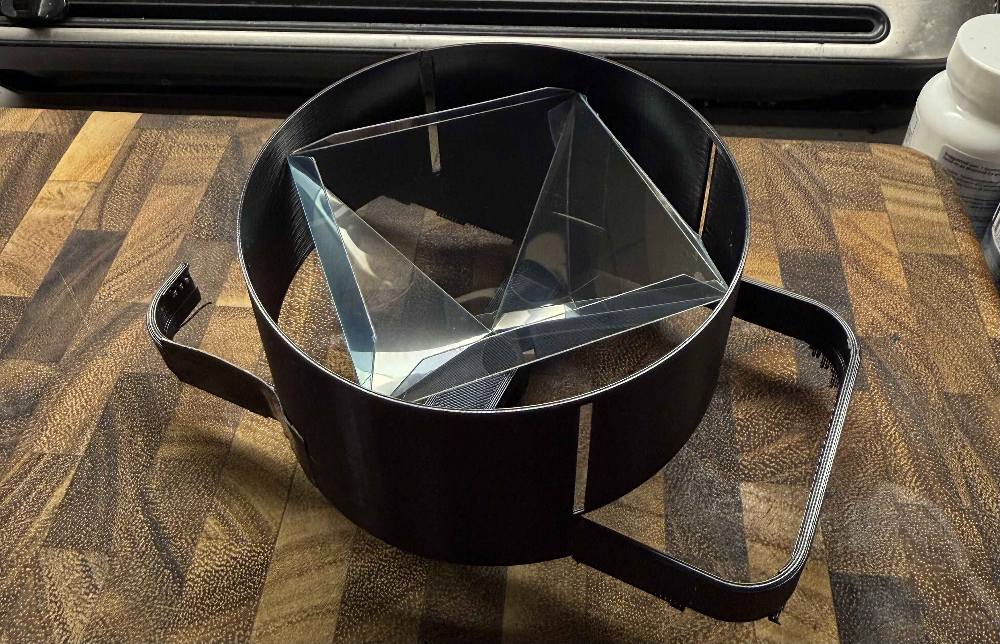

# [Gyrograms](zalo.github.io/Gyrograms/)

<p align="left">
  <a href="https://github.com/zalo/Gyrograms/deployments/activity_log?environment=github-pages">
      </a>
  <a href="https://github.com/zalo/Gyrograms/commits/main">
      </a>
  <a href="https://github.com/zalo/Gyrograms/blob/master/LICENSE">
      </a>
</p>

A viewer for 360 spinning phone zoetrope displays.

Based on the Holopot 360 Display, but with a 4-sided Pepper's Ghost Pyramid to reduce the RPM requirements to 1/4.

### Early Prototype Footage: https://youtu.be/EXZ7FneS4tw

### Early Prototype Assembly Close-up: 

 # Building

This demo can either be run without building (in Chrome/Edge/Opera since raw three.js examples need [Import Maps](https://caniuse.com/import-maps)), or built with:
```
npm install
npm run build
```
After building, make sure to edit the index .html to point from `"./src/main.js"` to `"./build/main.js"`.

 # Dependencies
 - [three.js](https://github.com/mrdoob/three.js/) (3D Rendering Engine)
 - [esbuild](https://github.com/evanw/esbuild/) (Bundler)
